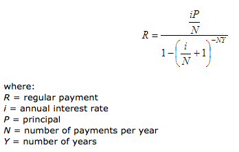

# Description
ZOPA Technical Coding Challenge.

# Assumptions
- The CSV doesn't provide a unique identifier for each Lender. The data structure allows duplicates i.e. A lender with the same name can have multiple records with different amounts/rates.
- The decimal values for repayment amounts and the rate of the loan use the round half up algorithm provided by Java's String.format default behaviour.
- Please add the MarketCSVService CSV file to the classpath for simplicity i.e. Every file under src/main/resources will be loaded into the classpath. The sample CSV file is already there and ready to be executed `MarketCSVService Data for Exercise - csv.csv`

# Technology Stack

| Technology                                                | Version                              |
| :--- | :--- |
| Git                                                       | 2.17.0                               |
| Apache Maven                                              | 3.5.4                                |
| Java 10                                                   | Java(TM) SE Runtime Environment 18.3 |
| Spring Boot                                               | 2.1.0.RELEASE                        |
| OpenCSV Library JAR                                       | 4.3                                  |
| Lombok project JAR                                        | 1.18.4                               |

# Reading the CSV File
[OpenCSV](http://opencsv.sourceforge.net) is an CSV (comma-separated values) parser library for Java.
Each CSV record is parsed into a [Lender](src/main/java/co/uk/zopa/challenge/entities/Lender.java) object using the following annotations
```java
@CsvBindByPosition(position = 1)
```

# Lombok
In order to increase readability and remove boilerplate code, [project lombok](https://projectlombok.org) was used to automatically generate auxiliary methods e.g. getters/setters, Slf4j

# Overall Solution Design
1. Parse the CSV file into a Collection
2. Order the collection by rate since we will be offering the best possible rates
3. Validate quote request
   * Check if the loan amount doesn't violate restrictions
   * Verify if the marketCSVService can satisfy the loan
4. Calculate the weighted average to provide the borrower with a rate
5. Calculate monthly and total repayment using the following formula
    

# Run the Example
`git clone https://github.com/jpsmoura/zopa.git`

`cd zopa`

`chmod 755 *`

`./mvnw spring-boot:run -Dcsv.filename='Market Data for Exercise - csv.csv' -Dloan.amount=1000`

Any property passed in the command line will override the default configuration provided in the [configuration](src/main/resources/application.properties) file

## Mismatch of output
The precision of decimal values is dependent on the primitive type and programming language used. In order to improve precision in Java, I could have used BigDecimal instead of double.

### Sample Provided
Requested amount: £1000
Rate: 7.0%
Monthly repayment: £30.78
Total repayment: £1108.10

### My Solution
Requested amount: 1000£
Rate: 7.0%
Monthly repayment: 30.88£
Total repayment: 1111.64£

# Run Unit Tests
./mvnw clean test

# Logging
- For debugging purposes please change the logging level to `DEBUG` on the application.properties file.
`logging.level.co.uk.zopa=INFO`

# TODOS/Improvements
- Accept URLs for CSV file location e.g. AWS S3 Bucket direct access
- Create an API to allow reuse of functionality
- Dockerise application to allow horizontal scaling, portability and application isolation
- Load the CSV collection into a shared in-memory DB (Redis)
- Documentation (Generate JavaDocs, Document API e.g. Swagger, Generate Code Coverage Reports e.g. Jacoco)
- Build CI/CD Pipelines e.g. Jenkins
...
